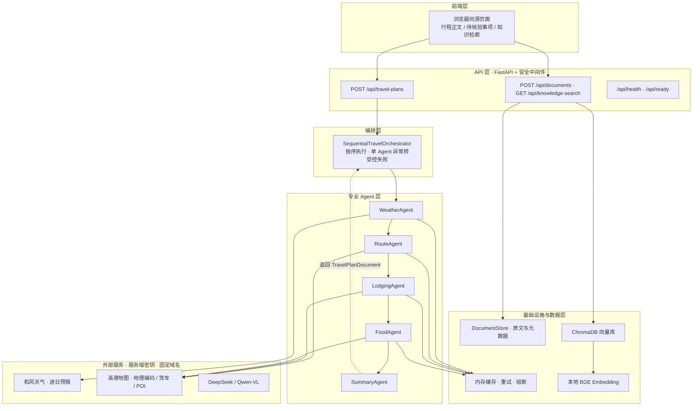
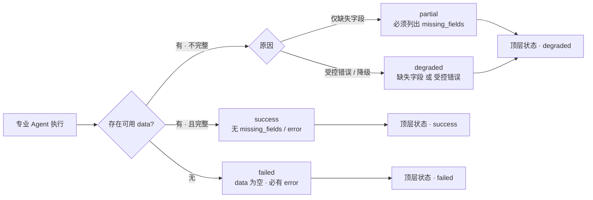
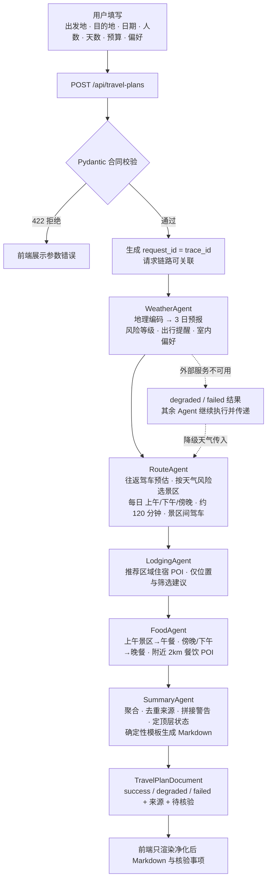
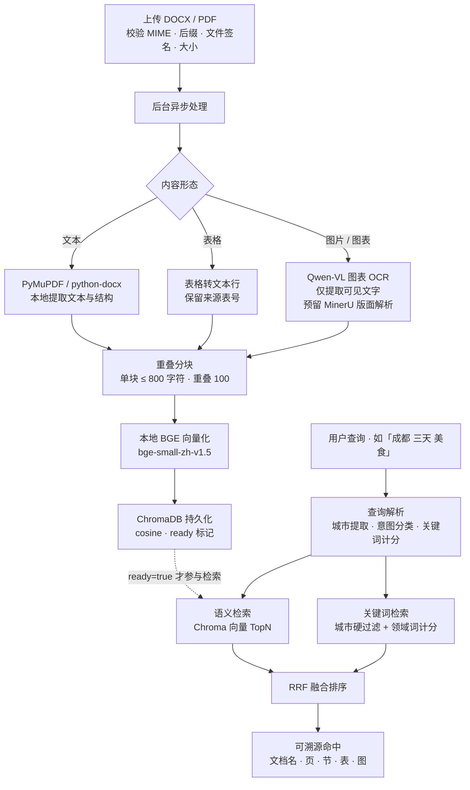
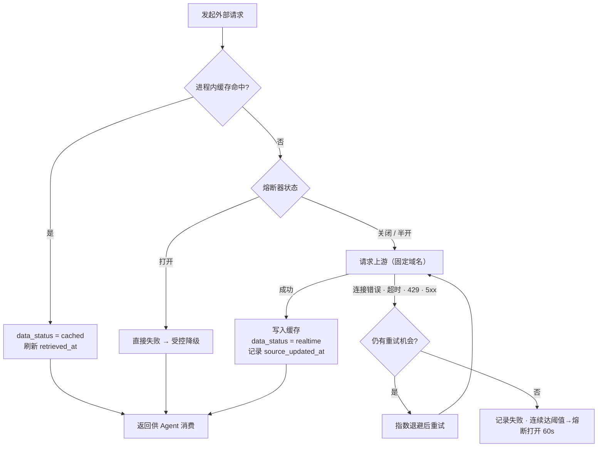

# 智能文旅策划助手 —— 毕业设计答辩讲解稿

> **项目定位**：面向企业场景的只读式智能文旅行程规划 Agent。事实靠确定性代码保证正确，表达用受控 LLM 增强可读性，安全与韧性贯穿始终。
>
> **答辩人**：＿＿＿＿＿＿　**学号/班级**：＿＿＿＿＿＿　**指导教师**：＿＿＿＿＿＿　**讲解时长**：10–15 分钟

---

## ◎ 四大主题速览

> 答辩主线浓缩为四个主题，本稿均以独立章节展开：

| 主题 | 一句话概括 | 详见 |
| --- | --- | --- |
| ① 痛点 | 用户侧信息分散 / 决策成本高 / 不敢信；工程侧异构数据源、字段漂移、降级状态不一致 | [01](#01-项目背景) |
| ② 难点 | 异构数据统一为强类型事实、局部失败可控降级、防 LLM 幻觉的架构约束 | [02](#02-问题难点与核心挑战) |
| ③ 技术栈 | FastAPI + Pydantic v2、多 Agent 编排、ChromaDB + BGE 本地 RAG、韧性三件套 | [05](#05-技术栈选型) |
| ④ 亮点 | 数据合同驱动、确定性事实 + 受控表达、可溯源混合检索、领域边界清晰 | [14](#14-项目亮点与创新点) |

---

## 01 项目背景

一次企业团建或差旅规划，需要在同一时刻处理日期、活动区域、天气风险、路线估算、餐饮住宿候选等多个互相依赖的维度——这正是通用旅行工具覆盖最薄弱、出错代价又最高的场景。

**业务场景**：本系统定位为面向企业内部旅行规划场景的**只读式行程建议服务**。输入出发地、目的地、出行日期、人数、天数、预算与偏好，返回「天气风险 + 每日景区路线 + 住宿区域 + 餐饮候选 + 待核验事项」的结构化行程。MVP 只给建议与核验提示，**不执行预订、支付或任何交易**。

**用户角度的痛点（为什么需要这个项目）**：

- **信息分散**：查天气、路线、美食、住宿要跨多个 App 与网页手动拼装，容易遗漏关键风险（如极端天气、交通不便）；
- **决策成本高**：攻略信息过载且彼此矛盾，难以在有限时间内权衡天气风险、路线顺路与预算约束；
- **缺少针对性**：通用攻略不分季节、天气与人群，亲子、商务、老人等场景难以直接套用；
- **信息可信度低**：网上攻略常已过时或夹带营销，来源不明，用户不敢直接照做；
- **时间成本高**：人工规划一次 3–5 天、多目的地的行程往往需要数小时；
- **企业场景放大**：团建 / 差旅往往人数多、天数多、有预算约束，行政或 HR 手工汇总成本更高。

**传统方案与技术视角的痛点**：

- **数据来源异构**：天气来自和风天气、地图路线与 POI 来自高德地图，字段名、单位、时间语义各不相同；
- **字段漂移**：模块间传自由字典，一处拼错/改名字段，下游无人察觉，直到运行时才暴露；
- **来源时间混淆**：缓存命中与实时获取的数据不加区分，用户无法判断建议新鲜度；
- **上游错误泄露**：外部 API 原始异常、堆栈、参数透传给浏览器，既是安全隐患也难以理解；
- **降级状态不一致**：某路线接口超时后，是整体失败还是保留其余建议？状态语义不统一，前端无从表达。

**为什么做这个项目（创建动机与价值）**：

- **把「拼装信息」变成「复核结果」**：自动把碎片化实时信息收敛为结构化、可核验的行程建议，降低出行前的决策与时间成本；
- **把专业经验固化为规则**：天气风险实时驱动行程安排（高风险自动转向室内文化场所），不依赖某个人的经验；
- **让信息「敢用」**：每条建议都附带来源与更新时间、区分实时 / 缓存 / 降级，可信是价值的前提；
- **让企业知识可沉淀**：文档知识库把历史攻略变成可检索资产，二次规划无需重新搜集资料。

> **一句话背景**：对用户，它把碎片信息收敛为可核验的行程建议，解决「信息分散、决策成本高、不敢信」的出行痛点；对工程，它把异构、脆弱、语义各异的数据源收敛为强类型、可追溯、可降级的事实。

---

## 02 问题、难点与核心挑战

| 挑战 | 内容 |
| --- | --- |
| 数据源异构 | 天气、地图、POI 来自不同供应商，需统一为规范化领域模型 |
| 事实与表达分离 | 机器可消费的 `itinerary` 是唯一事实载体；`markdown` 是阅读表现层，不能反向解析为事实 |
| 上游脆弱性 | 超时、限流、5xx 随时发生，需要缓存、重试、熔断、降级的组合 |
| 可追溯性 | 用户必须能核验建议来源与新鲜度，需要 `request_id / trace_id` 与来源时间语义贯穿 |
| 内容可信 | LLM 存在幻觉风险，模型只做判断与表达，事实由确定性代码负责 |
| 领域边界 | 只做只读建议，严禁价格、库存、评分、预订等交易字段，从模型层直接拒绝 |

> **核心难点归纳**：① 把异构、脆弱的数据源统一为强类型事实；② 局部失败时保证降级状态一致且可核验；③ 从架构上约束 LLM 只做表达、不做事实，防止幻觉。三者的共同解法都落在「数据合同 + 确定性编排」上。

---

## 03 项目目标与范围（MVP 边界）

**设计目标**：

1. 以强类型数据合同连接天气、路线、住宿、餐饮、汇总与 API，杜绝字段漂移；
2. 以 `request_id` 与 `trace_id` 贯穿一次请求，支持日志关联与问题定位；
3. 清晰区分实时数据、缓存数据、降级结果，要求用户对关键事实复核；
4. 以同源、双栏页面展示行程正文与待核验事项，不把供应商原始响应暴露给浏览器；
5. 以服务端密钥、固定域名、受控超时、重试与熔断建立最小安全边界。

**本轮包含**：FastAPI 后端 + 同源静态前端；天气/路线/住宿/餐饮/汇总五类专业 Agent 与顺序编排器；和风天气与高德地图受控 HTTP 客户端、进程内缓存重试熔断；文档知识库（DOCX/PDF 上传、解析、分块、向量化、混合检索 RAG）；健康/就绪检查与规划、文档接口。

**明确不接入（非目标）**：本轮不接入 OTA、酒店或餐厅交易、预订、支付、库存、实时价格、优惠、排队、评分与订单链接。模型使用 `extra="forbid"` 拒绝任何未声明字段，从数据结构上禁止把交易信息带入结果。密钥不提交，真实密钥也不进入文档示例。

---

## 04 功能模块总览

| 功能域 | 说明 |
| --- | --- |
| 出行规划 | 天气风险 → 逐日景区路线 → 住宿区域 → 餐饮候选 → 汇总成稿，产出可核验结构化行程与 Markdown |
| 知识库 RAG | 上传攻略文档，后台解析、分块、向量化入库；语义 + 关键词混合检索，命中可溯源到文档/页/节 |
| 前端工作台 | 出行规划表单、知识检索、文档库管理、数据看板；左行程正文、右待核验事项，窄屏转单栏 |
| 平台能力 | 健康/就绪检查、缓存重试熔断、全链路追踪标识、安全响应头、通用错误、XSS 净化与严格模型 |

**核心模块清单**：

| 模块 | 主要职责 | 输入 → 输出 |
| --- | --- | --- |
| `api/travel.py` | 规划接口，读取请求标识，隐藏未预期异常 | JSON 请求 → TravelPlanDocument |
| `main.py` | 创建应用，挂载安全中间件、CORS、健康检查与前端静态目录 | Settings → 可运行应用 |
| `models/travel.py` | 封闭字段、边界、状态一致性、来源时间、UUID 合同 | 请求与结果 → 不可变模型 |
| `services/heweather.py` | 和风天气逐日预报，规范化字段 | 经纬度/日期/天数 → DailyWeather |
| `services/amap.py` | 高德地理编码、驾车路线、POI，规范化字段 | 地点/坐标/关键词 → 地点、路线、POI |
| `orchestration/sequential.py` | 固定顺序编排，单 Agent 异常转为受控失败 | 请求 → 最终文档 |
| `services/document_*.py` | 文档存储、解析、分块、向量化与检索 | 文档/查询 → 可溯源命中 |
| `frontend/` | 表单校验、调用相对路径 API、净化渲染 Markdown | 表单 → 页面结果 |

---

## 05 技术栈选型

**选型原则**：凡事实性、确定性、可校验的职责交给成熟代码库；凡判断性、表达性职责才交给模型，并让每一层都可在本地完整测试。

| 层次 | 选型 | 为什么选它 | 备选与取舍 |
| --- | --- | --- | --- |
| 后端框架 | Python 3.12 + FastAPI 0.115 | 原生异步 + 类型标注，契合「强类型合同 + 异步 IO」；自动 OpenAPI | Flask 同步、Django 偏重 |
| 数据合同 | Pydantic v2 | `extra="forbid"` + `frozen` 把禁止未声明字段、不可变写进类型；`model_validator` 承载跨字段约束 | dataclass 无校验边界 |
| HTTP 客户端 | httpx.AsyncClient | 超时三要素、与测试库 respx 同源 mock | requests 同步 |
| 前端 | 原生 HTML/CSS/JS | 零构建、零供应链依赖；依赖仅本地 vendor（marked + DOMPurify）并校验 SHA-256 | React/Vue 对纯展示层过重 |
| 向量库 | ChromaDB（PersistentClient） | 嵌入式、可持久化、无需独立服务；cosine 空间 | Milvus/Weaviate 需独立运维 |
| Embedding | BGE-small-zh-v1.5（本地） | 中文效果好、体积小；本地推理使文档数据不出域 | 在线 embedding 引入外发与费用 |
| 文档解析 | PyMuPDF / python-docx | 本地提取文本、表格与图片，无需外发 | 扫描件/复杂版面 → 预留 MinerU + Qwen-VL |
| 视觉模型 | Qwen-VL（图表 OCR） | 仅提取图中可见文字，prompt 显式禁止趋势推理；可降级 | 不接通用 VQA |
| 语言模型 | DeepSeek（deepseek-chat） | 仅用于表达润色，低温度、受控只读；客户端已封装，接入设计中 | 不在事实层生成 |
| 测试 | pytest + respx | 拦截 httpx 模拟成功/超时/429/5xx，零真实调用 | 真实调用不可复现 |

> **为什么不引入 Agent 框架（如 LangChain）？** 本项目难点不在「调用 LLM」，而在数据合同、编排韧性、可追溯性与领域边界。这些用 FastAPI + Pydantic + 轻量编排器即可精确控制，行为完全确定、可测试；框架会引入黑盒行为与额外抽象。

---

## 06 系统架构

**图 1 · 系统总体架构**。虚线为结果回传路径：SummaryAgent 的结果经编排器返回 API，最终由前端渲染。

**关键架构决策**：

- **强类型合同贯穿**：请求、Agent 结果、来源、最终文档全部是 Pydantic 模型；跨模块传对象而非自由字典，错误在边界处被拒绝；
- **事实与表达分离**：`itinerary` 是唯一事实载体，Markdown 由汇总器确定性生成，不能反推事实；
- **同源渲染**：前端与 API 同源部署，只调用相对路径，供应商原始响应不进浏览器；
- **服务端密钥 + 固定域名**：密钥仅后端读取，供应商 base_url 写死并校验。

---

## 07 强类型数据合同

**请求合同 TravelPlanRequest**：

| 字段 | 规则 | 设计意图 |
| --- | --- | --- |
| `origin / destination` | 去除首尾空白，非空 | 防止脏输入 |
| `departure_date` | 不得早于服务端当天 | 禁止规划已过去的行程 |
| `travelers` | 1–20 | 边界前置校验 |
| `days` | 1–14，默认 3 | 住宿晚数由服务端派生 max(days-1,0) |
| `budget` | 0–200000 整数或空 | 预算只作展示，不参与交易 |
| `preferences` | 最多 12 项 | 限制偏好注入面 |

**Agent 状态机**（结果信封 `AgentResult` 只有四种状态，字段组合被 `model_validator` 强制校验）：

**图 2 · Agent 状态机与顶层状态汇聚**。任一 failed → 顶层 failed；有 partial/degraded 而无 failed → 顶层 degraded。

**来源时间语义（可信度的核心）**：

- `retrieved_at`：本服务本次从上游获取、或从缓存读取该数据的时间，所有来源必须填写；
- `source_updated_at`：上游真实提供的内容更新时间（如和风天气 `updateTime`），上游未提供为 `null`，绝不能用 retrieved_at 顶替；
- `data_status`：`realtime`（本次上游获取）/ `cached`（缓存命中）/ `degraded`（降级结果）。

> **禁止交易字段**：领域合同拒绝 `price / live_price / inventory / availability / bookable / queue / discount / rating / review_score / order_url` 及其同义扩展。系统只给候选位置、区域、设施、菜系、偏好筛选与核验提示，不承诺价格、库存、营业或预订结果。

---

## 08 多 Agent 编排与任务实现流程

**图 3 · 旅行规划任务实现流程**。天气结果（含降级）作为路线 Agent 的输入，体现「按天气风险调整行程」的业务规则。

**五类专业 Agent 的职责**：

- **WeatherAgent · 天气与出游风险**：高德地理编码获取目的地经纬度 → 和风 3 日逐日预报。按「暴雨/台风/强对流/高温」生成风险等级、出行提醒与室内活动偏好；预报不足请求天数时返回 `partial` 并列出缺失日期。
- **RouteAgent · 逐日景区路线**：地理编码出发地/目的地 + 往返驾车预估；按天气风险选择「风景名胜」或「博物馆/美术馆/展馆」等室内文化场所；每日按上午/下午/傍晚排 3 个景区、建议约 120 分钟，并估算景区间驾车；候选不足时明确列出待补字段，不复用候选、不伪造结果。
- **LodgingAgent · 住宿区域**：按推荐活动区域查询住宿服务 POI，只输出位置与筛选建议，不输出价格、评分或预订链接。
- **FoodAgent · 餐饮候选**：按上午景区提供午餐、按傍晚景区（缺失时回退下午景区）提供晚餐，查询景区附近 2000 米餐饮 POI；只展示真实名称与地址，保留无结果日期。
- **SummaryAgent · 汇总成稿**：聚合四个结果，按 weather → route → lodging → food 顺序去重来源、拼接警告、确定顶层状态，并用确定性模板生成 Markdown。

---

## 09 文档知识库 · RAG 混合检索

**图 4 · 文档知识库流水线**。左半为入库链路，右半为检索链路；两条链路共用「原文在 DocumentStore、向量在 Chroma」的一致性设计。

**设计要点**：

- **上传即校验**：仅接受 MIME 与后缀一致、文件签名有效（PDF 头 / DOCX zip 头）的 DOCX/PDF；超限、伪造、脏文件名在入库前被拒；
- **来源可溯源**：每个分块保留 `source_page / section / table / figure / char_start / char_end`，检索命中可回指原文位置；
- **一致性双写**：原文与块数据唯一事实源在 `DocumentStore`（documents.json），Chroma 只存向量与受控元数据；未 `ready` 的文档不参与检索；
- **混合检索**：语义（BGE → Chroma TopN）+ 关键词（预置城市表硬过滤 + 意图词计分）经 RRF 融合排序；查询含城市时再按城市硬过滤。

> **当前版本说明**：PDF 目前在本地由 PyMuPDF 提取可访问文本与基础结构，不能保证扫描件 OCR、复杂版面、图表表格的完整还原；MinerU 客户端已封装、Qwen-VL 图表 OCR 已接入，用于后续受控外发解析与扫描件识别。

---

## 10 韧性设计 · 缓存 / 重试 / 熔断

**图 5 · 外部请求韧性流程**。业务参数错误（如 4xx 非 429）不盲目重试；熔断半开通过 generation token 控制探测。

**按数据真实变化频率设置 TTL**：

| 数据 | TTL | 理由 |
| --- | --- | --- |
| 和风天气逐日预报 | 30 分钟 | 天气变化较快 |
| 高德驾车路线 | 15 分钟 | 路况影响时长 |
| 高德 POI 搜索 | 1 小时 | 商家信息低频变化 |
| 高德地理编码 | 7 天 | 地名坐标几乎不变 |

**已知限制（答辩需如实说明）**：和风天气仅支持 3 日预报窗口；多日外部调用按顺序执行，暂未实现路线总 deadline 与 single-flight 防击穿；附近 POI 仅检查坐标字符串非空；认证、限流、租户隔离、集中式密钥、审计与监控等生产化治理尚未实现。

---

## 11 安全边界

- **密钥与域名**：密钥只从后端环境变量读取；供应商 `base_url` 固定并校验，客户端无法覆盖到任意地址；
- **严格模型**：`extra="forbid"` 拒绝未声明字段；`frozen` 构造后不可变；状态机约束在模型层强制校验；
- **XSS 防护**：Markdown 先 `marked.parse` 再由 `DOMPurify.sanitize` 净化；FORBID_TAGS 禁 script/style/svg/math，FORBID_ATTR 禁 on*；文本用 textContent；
- **供应链**：marked 与 DOMPurify 以本地 vendor 文件引入（非 CDN），带 SHA-256 与第三方声明；
- **通用错误**：API 返回通用错误，不泄露异常堆栈、请求参数与供应商原始响应体；失败摘要正则过滤 traceback/token/路径等敏感模式；
- **上传与网络**：文档校验 MIME/后缀/签名；文件名必须安全基名；MinerU 只允许 HTTPS 且主机白名单；CORS 仅允许同源配置。

---

## 12 前端与交互

- **首页工作台**：出行规划表单 + 数字人讲解占位 + 目的地知识检索入口；
- **任务结果**：左侧行程正文（时段、建议时长、驾车预估、午晚餐），右侧待核验事项、来源与更新时间、降级说明；
- **文档库**：上传、处理状态、分块浏览与删除管理；
- **数据看板**：按地区 / 来源文档的赞踩反馈与好评率（当前为界面原型 · 演示数据）；
- **响应式**：768px 断点下双栏转单栏。

> **可信交互原则**：前端从不把供应商原始响应直接暴露；JSON 仅作为 API 消费者与测试使用。用户看到的每条建议都伴随「待核验」「来源更新时间」等元信息。

---

## 13 测试与质量保障

- **mock 外部 API**：respx 拦截 httpx，模拟成功、超时、429、5xx，验证缓存命中、重试耗尽、熔断打开等状态分支；
- **合同校验测试**：围绕 `model_validator` 约束展开，验证「为什么需要此行为」而非仅「返回了什么」；
- **文档管线测试**：分块边界、来源定位、批量上传状态（accepted/rejected/unavailable）、删除补偿等独立用例；
- **质量门禁**：提交前必须通过文档测试、全量测试与 `git diff --check`。

---

## 14 项目亮点与创新点

1. **强类型数据合同驱动**：封闭字段 + 不可变 + 跨字段校验，把字段漂移 / 状态不一致消灭在类型层；
2. **确定性事实 + 受控表达**：事实获取与汇总全部用确定性代码，LLM 只做表达润色与 OCR 提取，从架构上防幻觉；
3. **四态状态机与来源时间语义**：success / partial / degraded / failed 在每个边界被强制校验，`retrieved_at` 与 `source_updated_at` 严格区分；
4. **韧性三件套 + 降级贯穿**：缓存 / 重试 / 熔断 / 降级沿链路传递，单点故障不拖垮整体；
5. **可溯源混合检索 RAG**：城市硬过滤 + 意图词计分 + RRF 融合，命中回指原文位置；
6. **领域边界清晰**：明示非交易边界，从模型层禁止交易字段，安全边界体系化。

---

## 15 当前局限与后续规划

| 方向 | 内容 |
| --- | --- |
| 近期迭代 | 接入 DeepSeek 表达润色（客户端已封装）；和风 3 日窗口之外支持；本地经纬度格式校验；扫描件 OCR / MinerU 版面解析落地 |
| 性能优化 | single-flight 防缓存击穿；可观测异步连接池复用；有上限的缓存淘汰；请求级总超时预算共享 |
| 生产化 | 认证、限流、租户隔离、配额控制；集中式密钥管理；结构化审计日志、供应商调用指标、脱敏追踪与告警 |
| 体验扩展 | 数字人讲解（前端占位）；知识库内容反馈闭环（数据看板原型已就绪）；多文档对比问答 |

---

## 16 讲解节奏（10–15 分钟）

| 时间 | 内容 |
| --- | --- |
| 0:00 – 1:30 | 开场：一句话定位项目，背景与痛点 |
| 1:30 – 3:00 | 目标与范围、功能模块总览、MVP 非交易边界 |
| 3:00 – 5:00 | 技术栈选型与取舍理由 |
| 5:00 – 7:30 | 系统架构图 + 强类型数据合同 + Agent 状态机 |
| 7:30 – 10:00 | 多 Agent 编排与任务流程，五类 Agent 职责 |
| 10:00 – 11:30 | 文档知识库 RAG + 韧性设计 |
| 11:30 – 12:30 | 安全边界、前端交互、测试与质量 |
| 12:30 – 14:00 | 亮点与创新、局限与后续规划 |
| 14:00 – 15:00 | 总结与致谢，预留提问缓冲 |

---

## 17 答辩题库与参考回答

### 系统设计

**Q1. 为什么采用多 Agent 顺序编排，而不是让单个 LLM 一次生成完整行程？**

核心是把「事实获取」与「表达生成」分离。天气、路线、住宿、餐饮依赖不同实时数据源和各自的校验逻辑，用确定性代码逐项获取并校验为强类型事实；LLM 只做表达，且当前汇总还是确定性模板。这样：每条建议可追溯来源与时间；单一数据源故障可局部降级而非整体不可用；避免 LLM 在事实层编造路线或营业时间。

**Q2. 强类型数据合同解决了哪些实际问题？**

旅行数据来自异构供应商，字段名、单位、时间语义各不相同。若 Agent 间传自由字典，会出现字段漂移、来源时间混淆、上游错误泄露、降级状态不一致。合同把所有跨模块数据建模为封闭、不可变、带约束的模型，不符合声明的数据在边界处即被拒绝，把错误前置到「数据进入的瞬间」。

**Q3. 为什么汇总用确定性模板生成 Markdown，而不交给 LLM？**

行程是用户要据此出行的事实性文档。模板从结构化事实直接生成 Markdown，保证表达与事实严格一致、可核验、可测试；LLM 生成可能有文采，但可能改写、遗漏或编造事实且不稳定。项目把 LLM 定位为「表达润色」（DeepSeek 集成设计中），只读、不改变事实。

**Q4. realtime / cached / degraded 三种数据状态是如何设计的？**

每种来源都携带 `data_status`：本次上游获取为 realtime，命中缓存为 cached（刷新 retrieved_at），降级结果为 degraded。前端据此提示哪些信息需要核验。`source_updated_at` 记录供应商真实更新时间，绝不拿 retrieved_at 顶替。状态沿链路传递并汇入最终文档。

**Q5. request_id 与 trace_id 贯穿一次请求的价值？**

一次规划跨多个 Agent 和多轮外部调用，出错时若无关联标识，日志无法串起链路。`request_id` 用于跨层关联（HTTP 头、日志、响应一致），`trace_id` 保留未来接入细粒度链路追踪的兼容位置；当前二者取相同值。

### 技术细节

**Q6. 熔断器如何实现半开探测？**

用 generation token 控制：每次进入打开状态 generation+1，失败/成功记录只认当前 generation，避免旧请求的失败污染新状态。熔断打开满 `open_seconds` 后放行一次探测请求：成功则关闭并重置计数，失败则重新打开。

**Q7. 缓存 TTL 为什么分不同粒度？**

按数据真实变化频率设置：地理编码 7 天（几乎不变）、驾车路线 15 分钟（受路况影响）、POI 1 小时、天气预报 30 分钟。既减少上游调用，又不过度使用过期数据；命中时标记 cached 而非 realtime。

**Q8. 重试策略为什么「有的错误不重试」？**

只对连接错误、超时、HTTP 429 与 5xx 做最多 3 次指数退避重试，因为这些是瞬时可恢复的。业务参数错误（如 4xx 非 429）重试也必然失败，反而放大上游压力，因此直接暴露为受控失败。

**Q9. 单 Agent 失败时如何保证系统仍可用？**

编排器对每个 Agent 用 `_safe_agent_call` 包裹：异常被转换为受控 `failed` 结果（含错误码、缺失字段、retryable 标记），其余 Agent 继续执行；汇总器据此确定顶层状态。

### RAG 与 LLM

**Q10. 文档库为什么用混合检索，查询带城市时还要硬过滤？**

用户查询常含城市（「成都美食」），文档也按城市区分。若只靠向量相似度，可能出现「语义相近但城市不符」的误命中。方案：先解析查询提取城市做硬过滤；再以意图关键词与语义向量双路检索，RRF 融合排序。

**Q11. ChromaDB 与 DocumentStore 的职责为什么分开？**

Chroma 只存向量与受控元数据，原文块与文档记录统一由 DocumentStore（documents.json）持有，检索命中后回查取内容。好处：单一事实源避免两处内容不一致；未 ready 的文档不参与检索；删除/重处理可补偿清理向量。

**Q12. 如何防止 LLM 在事实生成上的幻觉？**

三层：第一，事实获取交给确定性代码，LLM 不做事实路由；第二，即便接入 DeepSeek 润色，也只读基于结构化事实改写表达，输出以结构化数据为准并保留来源与核验提示；第三，Qwen-VL 的 prompt 明确「仅提取可见文字、禁止趋势推理」。

**Q13. 本地 BGE 而不是在线 Embedding API？**

中文效果好、体积小，本地推理使文档数据不出域，与「只读、不外发」的安全目标一致；也避免在线 API 的延迟、费用与停机依赖。

### 安全

**Q14. 前端 XSS 防护如何设计？**

Markdown 先 `marked.parse` 再由 `DOMPurify.sanitize` 净化；FORBID_TAGS 禁 script/style/svg/math，FORBID_ATTR 禁 on* 事件属性；列表与错误文本用 textContent；依赖以本地 vendor 文件提供并带 SHA-256。

**Q15. 为什么服务端密钥不能进前端？CORS / 同源如何控制？**

密钥放前端等于公开给任何人滥用并产生费用与配额风险。密钥只从后端环境变量读取，前端只调用相对路径 `/api/*`，由后端统一携带密钥调用上游。CORS 只允许配置的同源来源；供应商 base_url 写死并由后端校验。

### 工程推进

**Q16. 如何测试外部 API 而不产生真实调用和费用？**

用 respx 拦截 httpx 调用，在测试中模拟成功、超时、429、5xx，同时覆盖缓存命中、重试耗尽、熔断打开等状态；配合真实 Pydantic 模型做合同校验。

**Q17. 如果升级为多用户 / 多租户，哪些地方要改？**

当前文档存储与向量库是单租户、无认证。升级需：请求鉴权与用户隔离（文档归属、检索范围过滤）、并发控制与限流、集中式密钥管理、可观测与审计日志、缓存从进程内迁移为共享缓存。

**Q18. 项目最大的工程难点是什么？**

最具代表性的是「异构数据源的强类型统一与降级语义」：四类 Agent 消费不同上游、可能部分失败，要保证状态机在每个边界被校验、缺失字段显式列出、顶层状态正确汇聚、来源去重不因读取时间变化而重复。为此用 model_validator 把约束编码进合同。

**Q19. 一句话概括你的项目？**

把异构实时数据（天气、地图、POI）收敛为强类型事实、由多 Agent 顺序编排产出可核验行程、并以文档知识库支持可溯源检索的只读式智能文旅行程规划服务——事实靠确定性代码保证正确，表达用 LLM 增强可读性，安全与韧性贯穿始终。

> **高频追问提示**：①「DeepSeek 接入后如果输出与事实冲突怎么办？」→ 输出仍以结构化事实为准，润色只读、可弃用；②「为什么不做实时价格 / 预订？」→ 明确非交易边界；③「多实例部署时进程内缓存怎么办？」→ 迁移为共享缓存 + single-flight，属生产化规划。

---

## 18 结语

本项目以「**事实靠确定性代码保证正确，表达用受控 LLM 增强可读性**」为主线，用强类型数据合同承载多 Agent 编排，用韧性设计对抗上游脆弱性，用混合检索知识库提供可溯源的信息支撑，并始终守住只读与非交易的领域边界。

当前版本是可核验、可测试、安全边界的 MVP；后续将在表达润色、生产化治理与体验扩展三个方向演进。

以上讲解完毕，欢迎各位老师提问。
